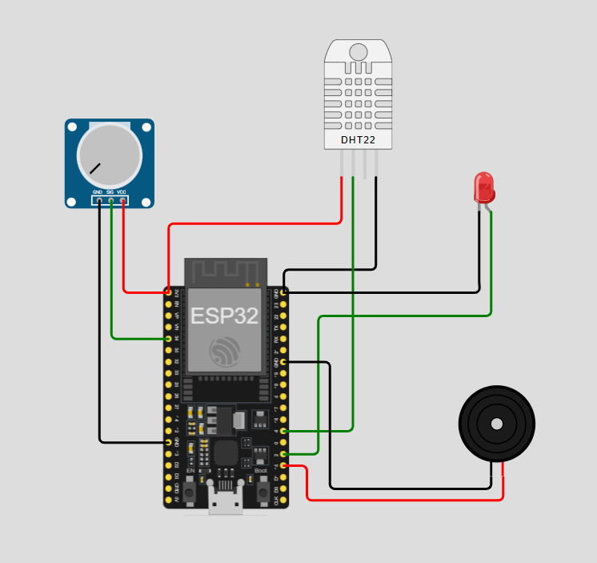
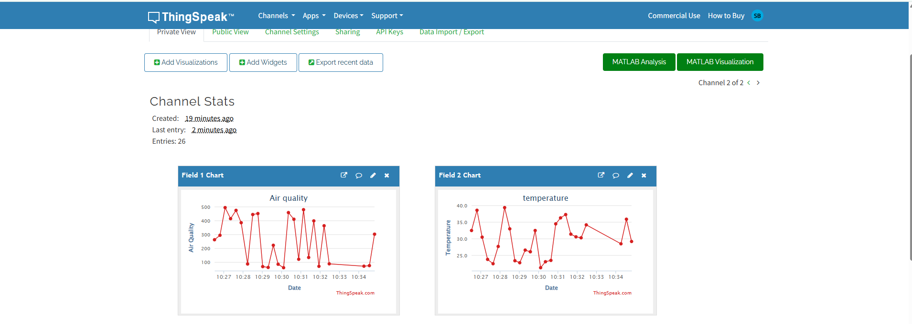
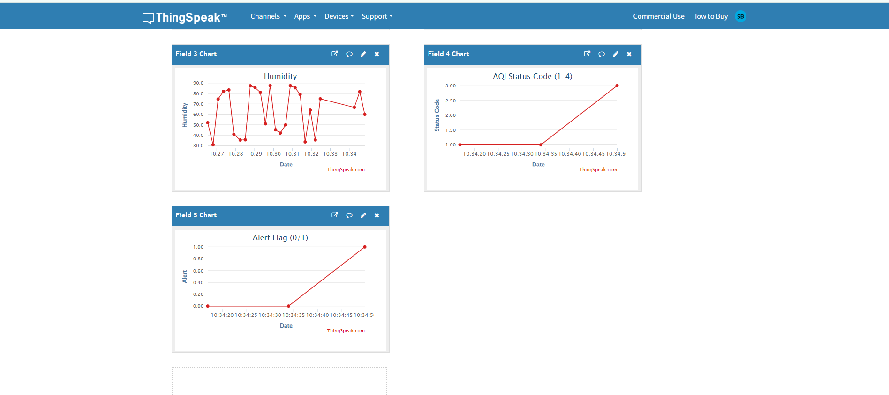

# 🌍 IoT Air Quality & Pollution Monitoring Dashboard

## 📌 Project Overview

The **IoT Air Quality & Pollution Monitoring Dashboard** is an environmental monitoring system designed to track air quality, temperature, and humidity in real time. The project combines IoT concepts, cloud analytics, data visualization, and environmental monitoring to provide actionable insights into air pollution levels.

The system uses an ESP32-based architecture (simulated in Wokwi), a DHT22 sensor for temperature and humidity monitoring, and a simulated MQ135 air quality sensor. Data is logged locally, visualized through Python dashboards, and uploaded to ThingSpeak for cloud-based monitoring and analytics.

---

## 🎯 Objectives

* Monitor environmental conditions in real time.
* Classify air quality into meaningful categories.
* Generate alerts for unsafe pollution levels.
* Store sensor readings for analysis.
* Visualize trends using charts and dashboards.
* Upload sensor data to the cloud using ThingSpeak.

---

## 🚀 Features

✅ Real-Time Air Quality Monitoring

✅ Temperature & Humidity Monitoring

✅ AQI Classification (Good, Moderate, Poor, Hazardous)

✅ Automated Alert Generation

✅ CSV Data Logging

✅ Data Visualization using Matplotlib

✅ Cloud Dashboard Integration with ThingSpeak

✅ ESP32 IoT Simulation using Wokwi

✅ Environmental Analytics and Reporting

---

## 🛠️ Technologies Used

### Hardware / IoT

* ESP32
* DHT22 Sensor
* MQ135 Sensor (Simulated)
* LED Indicator
* Buzzer

### Software

* Python
* Pandas
* Matplotlib
* Requests
* CSV

### Cloud Platform

* ThingSpeak

### Simulation Platform

* Wokwi

---

## 📂 Project Structure

```text
IoT-Air-Quality-Pollution-Monitoring-Dashboard/
│
├── arduino_code/
│   └── air_quality_monitor.ino
│
├── python_simulation/
│   ├── simulator.py
│   ├── dashboard.py
│   ├── report.py
│   └── aqi.py
│
├── dashboard/
│   └── thingspeak_setup.md
│
├── data/
│   └── air_quality_log.csv
│
├── outputs/
│   ├── charts/
│   └── reports/
│
├── images/
│
├── circuit_diagram/
│   └── wiring.png
│
├── docs/
│
├── requirements.txt
├── README.md
└── main.py
```

---

## ⚙️ System Workflow

```text
Sensor Simulation
        │
        ▼
ESP32 (Wokwi)
        │
        ▼
Python Data Processing
        │
        ▼
CSV Data Logging
        │
        ▼
ThingSpeak Cloud Dashboard
        │
        ▼
Analytics & Visualization
```

---

## 📊 AQI Classification

| AQI Value | Status    |
| --------- | --------- |
| 0 – 100   | GOOD      |
| 101 – 200 | MODERATE  |
| 201 – 350 | POOR      |
| 351+      | HAZARDOUS |

---

## 🔔 Alert Logic

| Status    | Alert  |
| --------- | ------ |
| GOOD      | Normal |
| MODERATE  | Normal |
| POOR      | Alert  |
| HAZARDOUS | Alert  |

When pollution reaches unsafe levels:

* LED turns ON
* Buzzer activates
* Alert is generated
* Cloud dashboard is updated

---

## ☁️ ThingSpeak Integration

The project uploads environmental data to ThingSpeak Cloud for remote monitoring.

### Channel Fields

| Field   | Data            |
| ------- | --------------- |
| Field 1 | Air Quality     |
| Field 2 | Temperature     |
| Field 3 | Humidity        |
| Field 4 | AQI Status Code |
| Field 5 | Alert Flag      |

---

## ▶️ Installation

### Clone Repository

```bash
git clone https://github.com/YOUR_USERNAME/IoT-Air-Quality-Pollution-Monitoring-Dashboard.git

cd IoT-Air-Quality-Pollution-Monitoring-Dashboard
```

### Create Virtual Environment

```bash
python -m venv venv
```

### Activate Environment

Windows:

```bash
venv\Scripts\activate
```

### Install Dependencies

```bash
pip install -r requirements.txt
```

---

## ▶️ Run Simulation

```bash
python main.py
```

---

## 📈 Generate Dashboard

```bash
python python_simulation/dashboard.py
```

---

## 📄 Generate Report

```bash
python python_simulation/report.py
```

---

## 📷 Project Screenshots

### Wokwi Circuit Simulation

Add image:

```markdown

```

### Air Quality Dashboard

```markdown

```

### ThingSpeak Dashboard

```markdown


```

### Alert Trigger

```markdown

```

---

## 🌱 Real-World Applications

* Smart Cities
* Environmental Monitoring
* Industrial Pollution Tracking
* Indoor Air Quality Monitoring
* Smart Buildings
* Public Health Monitoring

---

## 🔮 Future Enhancements

* Mobile App Integration
* SMS / Email Alerts
* Machine Learning-Based AQI Prediction
* GPS-Based Pollution Tracking
* Multi-Sensor Deployment
* Real Hardware Deployment

---

## 👩‍💻 Author

**Samreen Begum**

IoT | Python | Data Analytics | Embedded Systems Enthusiast

---

## ⭐ If you found this project useful

Please consider giving this repository a star.
